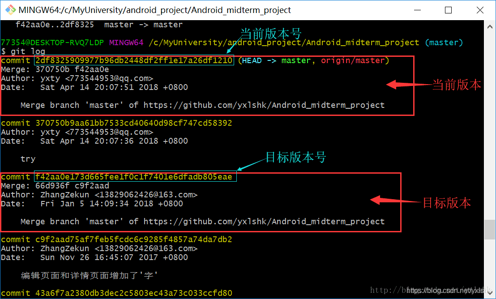

**方法一：git reset**

**原理：** git reset的作用是修改HEAD的位置，即将HEAD指向的位置改变为之前存在的某个版本，如下图所示，假设我们要回退到版本一：

**适用场景：** 如果想恢复到之前某个提交的版本，且那个版本之后提交的版本我们都不要了，就可以用这种方法。

**具体操作：**

**1. 查看版本号：**

可以使用命令“git log”查看：

也可以在github网站上查看：

