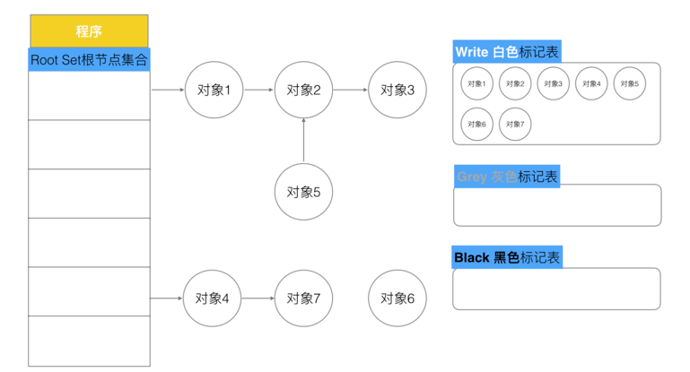

## 标记清除法

> STW（stop the world）→ 标记对象依赖关系 → 清楚待回收对象 → 结束STW
> 

步骤：

1. 暂停程序业务逻辑, 找出不可达的对象，和可达对象。
2. 开始标记，程序找出它所有可达的对象，并做上标记。
3. 开始清除未标记对象。
4. 停止STW，让程序恢复运行。

缺点：

- STW严重影响程序的运行效率
- 标记需要扫描整个heap
- 清除数据也会导致产生多余的heap碎片

优化：

- 将步骤3和4互换位置，缩短STW的范围

## 三色标记法

> 白色：待回收对象
灰色：待扫描对象
黑色：已扫描对象

目标：处理完所有灰色的对象为止
> 

步骤：

1. 将所有的对象标记为默认颜色“白色”
    
    
    
2. 从根节点（Root Set）出发，遍历将被根节点引用的对象标记为"灰色"
    
    
    
3. 遍历灰色集合，将灰色对象引用的白色对象标记为“灰色”，然后将遍历完的灰色对象标记为“黑色”
    
    
    
4. 重复步骤3，直到灰色集合中无任何对象
    
    
    
5. 最后回收所有白色集合对象
    
    
    

缺点（不启动STW保护）：

有可能造成对象丢失，即过程中黑色对象引用了白色对象，同时白色对象丢失了灰色对象的关系，导致GC把黑色对象引用的白色对象被回收

需同时满足两条件：

1. 一个白色对象被黑色对象引用（白色被挂载到黑色下）
2. 灰色对象与被挂载的白色对象关系遭到破坏（灰色同时丢失了白色的挂载）

## 强弱三色不变式

### 强三色不变式

> 强制性不允许黑色对象引用白色对象（破坏条件1）
> 

### 弱三色不变式

> 允许黑色对象引用白色对象，但白色对象必须存在链路上游有灰色对象保持有引用关系（破坏条件2）
> 

## 屏障机制

### 插入屏障

（为保证性能不在栈上使用）

> 在A对象引用B对象的时候，B对象被标记为灰色。（将B挂载在A下，B必须标记为灰色）
> 

满足`强三色不变式`（不存在黑色对象引用白色对象的情况，因为白色强制变为灰色）

步骤：

1. 当黑色对象引用白色对象时，触发写入屏障，使白色对象置为灰色对象。（使白色对象进入灰色集合，进入下一轮遍历）
2. 堆上的灰色集合遍历完成后，栈进行STW，

缺点：

结束时需要STW来重新扫描栈

### 删除屏障

实际也是写，将后对象置为nil，又名为删除写屏障。

> 被删除的对象，如果自身为白色或者灰色，那么都会被标记为灰色。
> 

满足`弱三色不变式`（保护灰色对象到白色对象的路径不会断）

步骤：

1. 当对象被删除时，触发删除写屏障，使删除对象置为灰色。（使删除对象这一轮GC不被删除）
2. 第二轮GC，上一轮不被删除的对象讲没有上游指向，即可被GC回收

缺点：

回收精度低，在一个对象被删除后，需要在第二轮GC才能被清楚。

## 混合写屏障

`栈不启用屏障`

> 变形的弱三色不变式（结合了插入、删除写屏障两者的优点）
> 

核心：

- GC开始时将栈上的`可达`对象全部扫描并标记为黑色（之后不再进行二次重复扫描，无需STW）
- GC期间，任何在栈上创建的新对象，均为黑色。
- 被删除的对象标记为灰色
- 被添加的对象标记为灰色

## 总结

- GO V1.3 普通的标记清除法，整体过程需要STW，效率极低
- GO V1.5 三色标记法，堆空间启动屏障，栈空间不启动，堆全部扫描后，需要重新启动一次STW扫描栈，效率普通
- GO V1.8 三色标记法 + 混合写屏障机制，堆空间启动，栈空间不启动，通过特殊规则实现弱三色不变式，整体过程几乎不用STW，效率极高