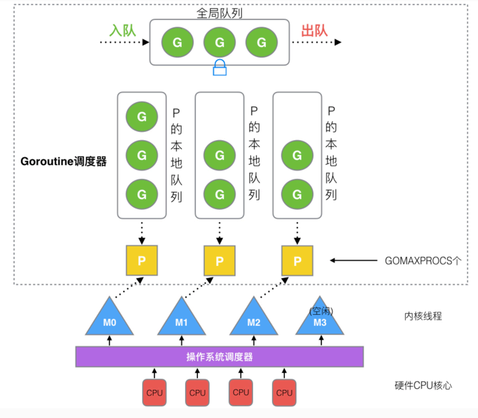

## Golang"调度器"由来

### 单进程时代

1. 单一执行流程，CPU只能顺序的执行任务队列
2. 进程阻塞导致CPU占用，浪费硬件资源，影响执行效率

### 多进程、多线程时代

- 设计变得复杂
    1. 进程/线程的数量越多，切换CPU执行时间片成本越大
    2. 多线程随着同步竞争（如 锁、竞争资源冲突等）
- 缺点
    1. 高内存占用 （进程：虚拟内存4G；线程：约4MB）
    2. 高CPU调度消耗
    

### 协程（co-routine）

- N:1
    1. 无法利用多个CPU
    2. 出现阻塞的瓶颈
- 1:1
    1. 跟多线程/多进程模型无异
    2. 协程切换成本高
- M:N
    1. 能够利用多核
    2. 过于依赖协程调度器的优化和算法

### 调度器的优化

- 早期Go调度器
    1. 基本的全局Go队列和比较传统的轮询利用多个thread去调度
    2. 弊端
        - 创建、销毁、调度G都需要每个M获取锁，形成了激烈的锁竞争
        - M转移G会造成延迟和额外的系统负载
        - 系统调用（CPU在M之间的切换）导致频繁的线程阻塞和取消阻塞的操作增加了系统的开销
- Goroutine优化
    1. 内存占用低（几KB，大量开辟）
    2. 灵活调度，切换成本低

## GMP模型的设计思想

### GMP模型简介



GMP

> G：goroutine 携程
P：processor 处理器
M：thread 内核线程
> 

全局队列

- 存放等待运行的G

P的本地队列

- 存放等待运行的G
- 数量限制（不超过256个G）
- 优先将创建的G存放在P的本地队列中，如果满了会放在全局队列

P列表

- 程序启动时创建
- 数量最多有GOMAXPROCS个（可配置）

M列表

- 当前操作系统分配到当前GO程序的内核线程数

P和M的数量

- P
    
    > 环境变量$GOMAXPROCS
    在程序中通过runtime.GOMAXPROCS()来设置
    > 
- M
    
    > Go语言本身限定M最大10000（忽略）
    runtime/debug 包中的SetMaxThreads函数设置
    有一个M阻塞，会创建新的M；
    有一个M空闲，会回收或者睡眠；
    > 

### 调度器设计策略

复用线程

- 避免频繁的创建、销毁线程，而是对线程的复用
    1. work stealing 机制
        
        > 当本线程无可运行的G时，尝试从其他线程绑定的P队列偷取G，而不是销毁线程。`偷取数量不是单个，而是别的队列后半部分`
        > 
    2. hand off 机制
        
        > 当本线程因为G进行系统调用阻塞时，线程释放绑定的P，把P转移到其他的空闲线程执行
        > 

利用并行

- GOMAXPROCS设置P的数量，最多有GOMAXPROCS个线程分部在多个CPU上同时运行

抢占

- 在coroutine中等待一个协程主动让出CPU才执行下一个协程，在GO中，一个goroutine最多占用CPU 10ms，防止其他goroutine饿死

全局G队列

- 假如M的本地队列P为空，则优先从全局队列获取G，如果全局队列为空，才尝试去别的队列偷取

### 调度优先级

> runnext->local runq->global runq->netpoller->steal
> 

## go func() 经历过程

### 步骤流程


1. 我们通过 go func()来创建一个goroutine；
2. 有两个存储G的队列，一个是局部调度器P的本地队列、一个是全局G队列。新创建的G会先保存在P的本地队列中，如果P的本地队列已经满了就会保存在全局的队列中；
3. G只能运行在M中，一个M必须持有一个P，M与P是1：1的关系。M会从P的本地队列列弹出一个可执行状态的G来执行，如果P的本地队列列为空，就会想其他的MP组合偷取一个可执行的G来执行；
4. 一个M调度G执行的过程是一个循环机制；
5. 当M执行某一个G时候如果发生了syscall或则其余阻塞操作，M会阻塞，如果当前有一些G在执行，runtime会把这个线程M从P中摘除(detach)，然后再创建一个新的操作系统的线程(如果有空闲的线程可用就复用空闲线程)来服务于这个P；
6. 当M系统调用结束时候，这个G会尝试获取一个空闲的P执行，并放入到这个P的本地队列。如果获取不到P，那么这个线程M变成休眠状态， 加入到空闲线程中，然后这个G会被放入全局队列列中。

## 调度器的声明周期

### M0

> M0是启动程序后的编号为0的主线程，这个M对应的实例会再全局变量runtime.m0中，不需要再heap上分配，M0负责执行初始化操作和启动第一个G，在之后M0就和其他的M一样了。
> 

### G0

> G0是每次启动一个M都会第一个创建的goroutine，G0仅用于负责调度的G，G0不指向任何可执行的函数，每个M都会有一个自己的G0。在调度或系统调用时会使用G0的栈空间，全局变量的G0是M0的G0。
> 

## 可视化GMP编程

### 基本trace编程

```go
// 1. 创建trace文件
f, err := os.Create("trace.out")

// 2. 启动trace
trace.Start(f)

// 3. 停止trace
trace.Stop()

// go build运行之后，会得到一个trace.out文件
```

### 使用可视化工具

```go
$go tool trace trace.out
```


## Debug Trace调试

```go
// schedtrace 为间隔多久打印信息
GODEBUG=schedtrace=1000 ./trace
```

### 参数解析


- SCHED 调试信息
- 0ms 从程序启动到输出经历的时间
- gomaxprocs P的数量（一般默认是和CPU的核数一致）
- idleprocs 处理idle状态的P的数量，gomaxprocs-idleprocs=目前正在执行的P数量
- threads 线程数量（包括M0，包括GODEBUG调试的线程）
- spinningthreads 处于自旋状态的thread数量
- idlethread 处理idle状态的thread
- runqueue 全局G队列的G数量
- [0, 0] 每个P的local queue本地队列中，目前存在的G数量

## 场景

### 场景1


- P拥有G1，M1获取P后开始运行G1，G1使⽤用go func()创建了G2，为了了局部性G2优先加入到P1的本地队列。

### 场景2


- G1运行完成后(函数：goexit)，M上运行的goroutine切换为G0，G0负责调度时协程的切换（函数：schedule）。
- 从P的本地队列取G2，从G0切换到G2，并开始运行G2(函数：execute)。实现了线程M1的复⽤用。

### 场景3、4、5


### 场景6


- 规定：在创建G时，运行的G会尝试唤醒其他空闲的P和M组合去执行。
- 假定G2唤醒了M2，M2绑定了P2，并运行G0，但P2本地队列没有G，M2此时为自旋线程（没有G但为运行状态的线程，不断寻找G）。

### 场景7


- M2尝试从全局队列(简称“GQ”)取一批G放到P2的本地队列（函数：findrunnable()）。M2从全局队列取的G数量量符合下⾯面的公式：
- $n = min(len(GQ)/GOMAXPROCS + 1,  len(GQ/2))$

### 场景8


- 全局队列已经没有G，那m就要执行work stealing(偷取)：从其他有G的P哪里偷取一半G过来，放到自己的P本地队列。P2从P1的本地队列尾部取一半的G，本例中一半则只有1个G8，放到P2的本地队列并执行。

### 场景9


- 最多有GOMAXPROCS个自旋的线程(当前例子中的GOMAXPROCS=4，所以一共4个P)，多余的没事做线程会让他们休眠。

### 场景10


- 假定当前除了M3和M4为自旋线程，还有M5和M6为空闲的线程(没有得到P的绑定，注意我们这里最多就只能够存在4个P，所以P的数量应该永远是M>=P, 大部分都是M在抢占需要运行的P)，G8创建了了G9，G8进行了阻塞的系统调用，M2和P2立即解绑，P2会执行以下判断：如果P2本地队列有G、全局队列有G或有空闲的M，P2都会立⻢马唤醒1个M和它绑定，否则P2则会加入到空闲P列表，等待M来获取可用的p。本场景中，P2本地队列有G9，可以和其他空闲的线程M5绑定。

### 场景11


- M2和P2会解绑，但M2会记住P2，然后G8和M2进⼊入系统调⽤用状态。当G8和M2退出系统调用时，会尝试获取P2，如果无法获取，则获取空闲的P，如果依然没有，G8会被记为可运行状态，并加入到全局队列,M2因为没有P的绑定而变成休眠状态(长时间休眠等待GC回收销毁)。