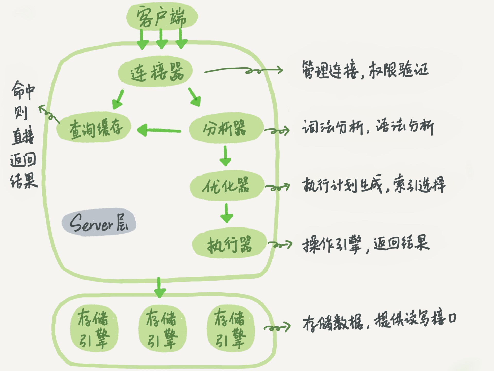

# 基础篇

## 01丨基础架构：一条SQL查询语句是如何执行的？



## 02丨日志系统：一条SQL更新语句是如何执行的？


## 03丨事务隔离：为什么你改了我还看不见？

> ACID（Atomicity、Consistency、Isolation、Durability，即原子性、一致性、隔离性、持久性）
> 
- 读未提交（read uncommitted）是指，一个事务还没提交时，它做的变更就能被别的事务看到。
- 读提交（read committed）是指，一个事务提交之后，它做的变更才会被其他事务看到。
- 可重复读（repeatable read）是指，一个事务执行过程中看到的数据，总是跟这个事务在启动时看到的数据是一致的。当然在可重复读隔离级别下，未提交变更对其他事务也是不可见的。
- 串行化（serializable ），顾名思义是对于同一行记录，“写”会加“写锁”，“读”会加“读锁”。当出现读写锁冲突的时候，后访问的事务必须等前一个事务执行完成，才能继续执行。

## 04丨深入浅出索引（上）

### 哈希表

适用于只有等值查询的场景，效率高，但无法范围查询

### 有序数组

等值查询和范围查询场景中的性能就都非常优秀，但是更新数据效率低下，所有后续数据需往后移

### 二叉树（BST）

各方面都非常优秀，但是极端情况下可能会发展为链表

### 平衡二叉树（AVL）

二叉树的变异体，会根据情况自动左右旋转，维持子节点的平衡，但是树高无法维护

### 红黑树（RBT）

相比较平衡二叉树，平衡条件宽松，只需保证左右深度差一倍，使写的操作变化减少，提高写的性能

### B树

可以拥有多节点，解决平衡二叉树存在的树层级太高，降低查询复杂度

### B+树

B树的变异体，讲数据存储在叶节点（也成为`聚簇索引`），叶子节点会保存前后的指针地址

## 05丨深入浅出索引（下）

### 覆盖索引

由于非主键索引存在回表的情况，所以select时选择主键字段，可以防止回表从而提高查询效率

### 最左前缀原则

# 实践篇

## 09丨普通索引和唯一索引，应该怎么选择？

### 查询过程

- 对于普通索引来说，查找到满足条件的第一个记录 (5,500) 后，需要查找下一个记录，直到碰到第一个不满足 k=5 条件的记录。
- 对于唯一索引来说，由于索引定义了唯一性，查找到第一个满足条件的记录后，就会停止继续检索。

> 结论：性能上`微乎其微`，业务看具体场景
> 

理论上唯一索引的性能会比普通索引快，但是引擎是按页进行读写的，所以查询key行数据时候，去取出的data page大概率会有下一行的记录，所以只需要在内存级别再判断一次下一行的记录是否符合条件。

即使复杂情况，key行在data page最后一行，必须读取下一页。这种情况换做整型的索引，但个data page可以存放上千个key，出现这种概率的情况也是极小的。

### 更新过程

了解新概念`change buffer`

- 当需要更新数据时候，在不影响一致性的情况下，innoDB会将这部分操作直接写到change buffer中。这样就不需要从磁盘中读取data page了。
- 将change buffer写入data page的过程称为`merge`，访问数据也则会触发，系统也会定期执行。
- 读取data page会占用`buffer pool`，这种方式可以提高内存利用率。

**实际对比**

唯一索引需要将data page读入内存，判断是否存在该值，所以无法使用change buffer

普通索引则只需要更新记录到change buffer即可结束

> 结论：`读多写少`的情况建议用`普通索引`，`强业务一致性`则用`唯一索引`
> 

### redo log 和 change buffer 区别

- redo log 主要节省的是随机写磁盘的 IO 消耗（转成顺序写），而 change buffer 主要节省的则是随机读磁盘的 IO 消耗。

## 10丨MySQL为什么有时候会选错索引？

### 出现场景

优化器会根据不同情况选择对应的最有索引进行查询，当表数据中`抽样统计`的预估行数等信息出现误差时，导致优化器选择了非最优查询方式。

### 执行流程


### 处理方法

- 使用analyze table命令刷新抽样统计
- 使用`force index(i1)`强制依赖某索引
    
    ```go
    select * from t force index(a) where a between 10000 and 20000;
    ```
    

## 11丨怎么给字符串字段加索引？

### 完整索引

直接创建完整索引，查询次数少，但是比较占用空间

### 前缀索引

节省空间，但是匹配精度降低，会增加查询扫描次数，并且无法使用覆盖索引

### 倒序存储

基于前缀索引，倒序存储数据，增加数据区分度

### hash字段

创建hash字段索引，查询性能稳定，但是有额外的存储开销，并且不支持范围查询

## 12丨为什么我的MySQL会“抖”一下？

**当内存数据页跟磁盘数据页内容不一致的时候，我们称这个内存页为“`脏页`”。内存数据写入到磁盘后，内存和磁盘上的数据页的内容就一致了，称为“`干净页`”。**

> 执行某sql时，可能存在redo log刷新数据到到磁盘的情况，而刷新的情况可能会比较多，导致延迟比较长
> 
- **场景1：**redo log写满时，需要暂停所有更新操作，把数据刷入磁盘并且往前移checkpoint
- **场景2：**内存满了，会淘汰某些数据页，假如为“脏页”，就要先将数据刷入磁盘
- **场景3：**空闲时间，应用会自动将脏页数据刷入磁盘
- **场景4：**mysql关闭的话，也会将脏页数据刷入磁盘

## 13丨为什么表数据删掉一半，表文件大小不变？

**原因：**表数据的删除，只是讲行标记为可复用状态，但实际上还是占用内存磁盘空间的。

**解决：**1. 重建表 alter table A engine=InnoDB

### Online DDL（Mysql 5.6开始引入）

优化表重建过程中，有新的更新语句执行时不会阻塞整个流程

**重建表流程：**

1. 建立一个临时文件，扫描表 A 主键的所有数据页；
2. 用数据页中表 A 的记录生成 B+ 树，存储到临时文件中；
3. 生成临时文件的过程中，将所有对 A 的操作记录在一个日志文件（row log）中，对应的是图中 state2 的状态；
4. 临时文件生成后，将日志文件中的操作应用到临时文件，得到一个逻辑数据上与表 A 相同的数据文件，对应的就是图中 state3 的状态；
5. 用临时文件替换表 A 的数据文件。


## 14丨count这么慢，我该怎么办？

- MyISAM 表虽然 count(*) 很快，但是不支持事务；
- show table status 命令虽然返回很快，但是不准确；
- InnoDB 表直接 count(*) 会遍历全表，虽然结果准确，但会导致性能问题。

**对于 count(主键 id) 来说**，InnoDB 引擎会遍历整张表，把每一行的 id 值都取出来，返回给 server 层。server 层拿到 id 后，判断是不可能为空的，就按行累加。

**对于 count(1) 来说**，InnoDB 引擎遍历整张表，但不取值。server 层对于返回的每一行，放一个数字“1”进去，判断是不可能为空的，按行累加。

**对于 count(字段) 来说**：

1. 如果这个“字段”是定义为 not null 的话，一行行地从记录里面读出这个字段，判断不能为 null，按行累加；
2. 如果这个“字段”定义允许为 null，那么执行的时候，判断到有可能是 null，还要把值取出来再判断一下，不是 null 才累加。

**但是 count(*)是例外**，并不会把全部字段取出来，而是专门做了优化，不取值。count(*) 肯定不是 null，按行累加。

> 结论：按照效率排序的话，count(字段)<count(主键 id)<count(1)≈count(*)，所以我建议你，尽量使用 count(*)
> 

## 16丨“orderby”是怎么工作的？


### 全字段排序流程

1. 初始化 sort_buffer，确定放入 name、city、age 这三个字段；
2. 从索引 city 找到第一个满足 city='杭州’条件的主键 id，也就是图中的 ID_X；
3. 到主键 id 索引取出整行，取 name、city、age 三个字段的值，存入 sort_buffer 中；
4. 从索引 city 取下一个记录的主键 id；
5. 重复步骤 3、4 直到 city 的值不满足查询条件为止，对应的主键 id 也就是图中的 ID_Y；
6. 对 sort_buffer 中的数据按照字段 name 做快速排序；
7. 按照排序结果取前 1000 行返回给客户端。


### rowid排序流程

1. 初始化 sort_buffer，确定放入两个字段，即 name 和 id；
2. 从索引 city 找到第一个满足 city='杭州’条件的主键 id，也就是图中的 ID_X；
3. 到主键 id 索引取出整行，取 name、id 这两个字段，存入 sort_buffer 中；
4. 从索引 city 取下一个记录的主键 id；
5. 重复步骤 3、4 直到不满足 city='杭州’条件为止，也就是图中的 ID_Y；
6. 对 sort_buffer 中的数据按照字段 name 进行排序；
7. 遍历排序结果，取前 1000 行，并按照 id 的值回到原表中取出 city、name 和 age 三个字段返回给客户端。

### 优化

1. 可将常需要排序的字段做联合索引
2. 使用覆盖索引优化回表逻辑

普通排序：


联合索引优化：

结果Extra字段去除了Using filesort字眼，表示排序去除了文件排序方式

```go
alter table t add index city_user(city, name);
```


覆盖索引优化：

结果Extra字段为Using index表示使用了覆盖索引，性能会更高


## 17丨如何正确地显示随机消息？

**小结**

今天这篇文章，我是借着随机排序的需求，跟你介绍了 MySQL 对临时表排序的执行过程。

如果你直接使用 order by rand()，这个语句需要 Using temporary 和 Using filesort，查询的执行代价往往是比较大的。所以，在设计的时候你要量避开这种写法。

今天的例子里面，我们不是仅仅在数据库内部解决问题，还会让应用代码配合拼接 SQL 语句。在实际应用的过程中，比较规范的用法就是：尽量将业务逻辑写在业务代码中，让数据库只做“读写数据”的事情。因此，这类方法的应用还是比较广泛的。

## 18丨为什么这些SQL语句逻辑相同，性能却差异巨大？

**小结**

今天我给你举了三个例子，其实是在说同一件事儿，即：**对索引字段做函数操作，可能会破坏索引值的有序性，因此优化器就决定放弃走树搜索功能。**

第二个例子是隐式类型转换，第三个例子是隐式字符编码转换，它们都跟第一个例子一样，因为要求在索引字段上做函数操作而导致了全索引扫描。

MySQL 的优化器确实有“偷懒”的嫌疑，即使简单地把 where id+1=1000 改写成 where id=1000-1 就能够用上索引快速查找，也不会主动做这个语句重写。

因此，每次你的业务代码升级时，把可能出现的、新的 SQL 语句 explain 一下，是一个很好的习惯。

## 19丨为什么我只查一行的语句，也执行这么慢？