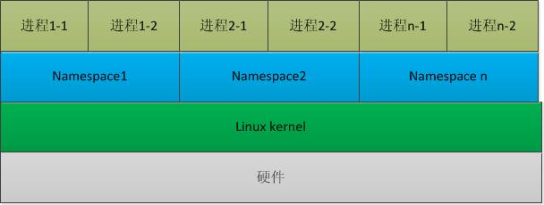

# 核心原理

## Namespace

> 独立进程，实现容器的 **隔离性**
> 

Linux Namespaces机制提供一种资源隔离方案。PID,IPC,Network等系统资源不再是全局性的，而是属于某个特定的Namespace。每个namespace下的资源对于其他namespace下的资源都是透明，不可见的。系统中可以同时存在两个进程号为0,1,2的进程，由于属于不同的namespace，所以它们之间并不冲突。而在用户层面上只能看到属于用户自己namespace下的资源，例如使用ps命令只能列出自己namespace下的进程。



## Cgroups

> 控制进程资源分配，实现容器的 **限制性**
> 

Linux Cgroups 的全称是 Linux Control Group。它最主要的作用，就是限制一个进程组能够使用的资源上限，包括 CPU、内存、磁盘、网络带宽等等。

基于namespace实现的隔离性，只限于容器中的可视范围控制。实际上对于宿主机而言，容器中的进程也是宿主进程中的其中一个，所以理论上，容器进程和宿主进程占用的资源权限是一致的。为了防止某个容器抢占大量的资源导致其他容器乃至宿主机的奔溃，所以docker使用的linux中的cgroups进行进程资源的限制。

ps：限制某进程使用的CPU核数等

## Rootfs

> 修改容器进程对于文件系统挂载点的可视范围，实现容器的 **一致性**
> 

在 Linux 操作系统里，有一个名为 chroot 的命令可以帮助你在 shell 中方便地完成这个工作。顾名思义，它的作用就是帮你“change root file system”，即改变进程的根目录到你指定的位置。

实际上，Mount Namespace 正是基于对 chroot 的不断改良才被发明出来的，它也是 Linux 操作系统里的第一个 Namespace。它对容器进程视图的改变，一定是伴随着挂载操作（mount）才能生效。

而这个挂载在容器根目录上、用来为容器进程提供隔离后执行环境的文件系统，就是所谓的“容器镜像”。它还有一个更为专业的名字，叫作：**rootfs**（根文件系统）。

rootfs 只是一个操作系统所包含的文件、配置和目录，并不包括操作系统内核。在 Linux 操作系统中，这两部分是分开存放的，操作系统只有在开机启动时才会加载指定版本的内核镜像。

由于 rootfs 里打包的不只是应用，而是整个操作系统的文件和目录，也就意味着，应用以及它运行所需要的所有依赖，都被封装在了一起。

# 镜像

为了防止容器碎片化，提高容器的复用率。Docker支持用Dockerfile的形式，对于现有容器镜像进行二次开发和定制化。

## Union File System

Union File System 也叫 UnionFS，最主要的功能是将多个不同位置的目录联合挂载（union mount）到同一个目录下。比如，我现在有两个目录 A 和 B，它们分别有两个文件：

```
$ tree
.
├── A
│  ├── a
│  └── x
└── B
  ├── b
  └── x
```

然后，我使用联合挂载的方式，将这两个目录挂载到一个公共的目录 C 上：

```
$ mkdir C
$ mount -t aufs -o dirs=./A:./B none ./C
```

这时，我再查看目录 C 的内容，就能看到目录 A 和 B 下的文件被合并到了一起：

```
$ tree ./C
./C
├── a
├── b
└── x
```

## Layer

Docker 在镜像的设计中，引入了层（layer）的概念。也就是说，用户制作镜像的每一步操作，都会生成一个层，也就是一个增量 rootfs。


### 1. 只读层

它是这个容器的 rootfs 最下面的五层，对应的正是 ubuntu:latest 镜像的五层。可以看到，它们的挂载方式都是只读的（ro+wh，即 readonly+whiteout）。

<aside>
💡 **whiteout**形象翻译成：”白障“，主要功能是为了实现删除操作。这个删除操作实际上是在可读写层创建了一个名叫.wh.foo 的文件。这样，当这两个层被联合挂载之后，foo 文件就会被.wh.foo 文件“遮挡”起来，“消失”了。

</aside>

这时，我们可以分别查看一下这些层的内容：

```
$ ls /var/lib/docker/aufs/diff/72b0744e06247c7d0...
etc sbin usr var
$ ls /var/lib/docker/aufs/diff/32e8e20064858c0f2...
run
$ ls /var/lib/docker/aufs/diff/a524a729adadedb900...
bin boot dev etc home lib lib64 media mnt opt proc root run sbin srv sys tmp usr var
```

可以看到，这些层，都以增量的方式分别包含了 Ubuntu 操作系统的一部分。

### 2. 可读写层

最上层的可读写层，挂载方式为：rw，即read write，Dockfile的操作将会让内容以文件的形式增量出现在这层。

所以，最上面这个可读写层的作用，就是专门用来存放你修改 rootfs 后产生的增量，无论是增、删、改，都发生在这里。而当我们使用完了这个被修改过的容器之后，还可以使用 docker commit 和 push 指令，保存这个被修改过的可读写层，并上传到 Docker Hub 上，供其他人使用；而与此同时，原先的只读层里的内容则不会有任何变化。这，就是增量 rootfs 的好处。

### 3. Init层

它是一个以“-init”结尾的层，夹在只读层和读写层之间。Init 层是 Docker 项目单独生成的一个内部层，专门用来存放 /etc/hosts、/etc/resolv.conf 等信息。

需要这样一层的原因是，这些文件本来属于只读的 Ubuntu 镜像的一部分，但是用户往往需要在启动容器时写入一些指定的值比如 hostname，所以就需要在可读写层对它们进行修改。

可是，这些修改往往只对当前的容器有效，我们并不希望执行 docker commit 时，把这些信息连同可读写层一起提交掉。

所以，Docker 做法是，在修改了这些文件之后，以一个单独的层挂载了出来。而用户执行 docker commit 只会提交可读写层，所以是不包含这些内容的。

# 机制

## Docker Exec

```sql
$ docker exec -it 4ddf4638572d /bin/sh
```

exec命令底层是调用了linux的setns()系统调用，作用是修改某进程内的namespace文件，将新的进程加入到指定的namespace中去。这样就实现了，讲宿主机的进程内嵌到指定的容器，并且访问视图namespace还是跟容器的一致。

## Volume

> Volume 机制，允许你将宿主机上指定的目录或者文件，挂载到容器里面进行读取和修改操作。
> 

Linux 的绑定挂载（bind mount）机制。它的主要作用就是，允许你将一个目录或者文件，而不是整个设备，挂载到一个指定的目录上。并且，这时你在该挂载点上进行的任何操作，只是发生在被挂载的目录或者文件上，而原挂载点的内容则会被隐藏起来且不受影响。


<aside>
💡 因为docker commit都是发生再宿主机空间的，而对于宿主机/test目录仍然是指向inode_2，这样对于宿主机而言，/test目录始终是空目录，所以commit的时候也不会讲文件进行合并上传，从而实现了隔离性。

</aside>

