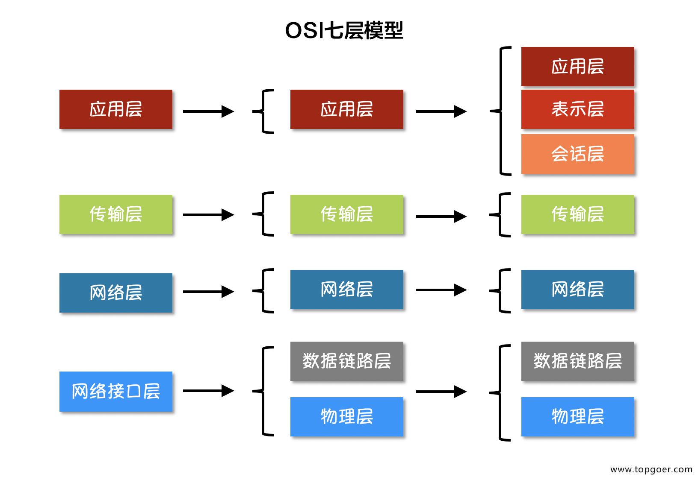

## 物理层

将计算机通过物理的方式连接起来，通过0/1的形式传输数据

## 数据链路层

将电信号0和1以**帧**形势整合成一个个的**数据包**，将数据以包的形式进行解析。并且将数据包发送到子网络中的所有机器，让机器识别数据包头中的MAC地址跟自己是否匹配，从而捕获分析数据，此过程称为**广播。**

## 网络层

在外网中，通过MAC地址去广播通信效率非常低，所以网络层主要是通过**IP协议**与其他的子网络进行通信。数据包通过外网ip发送到置顶的子网，子网设备内部再通过广播获取数据包。

## 传输层

机器接受到数据包后，通过网卡内的**端口**传输到各各应用进程中。典型代表：udp、tcp协议

## 应用层

应用进程通过Email、HTTP、FTP等通用协议进行收发数据包实现通信。