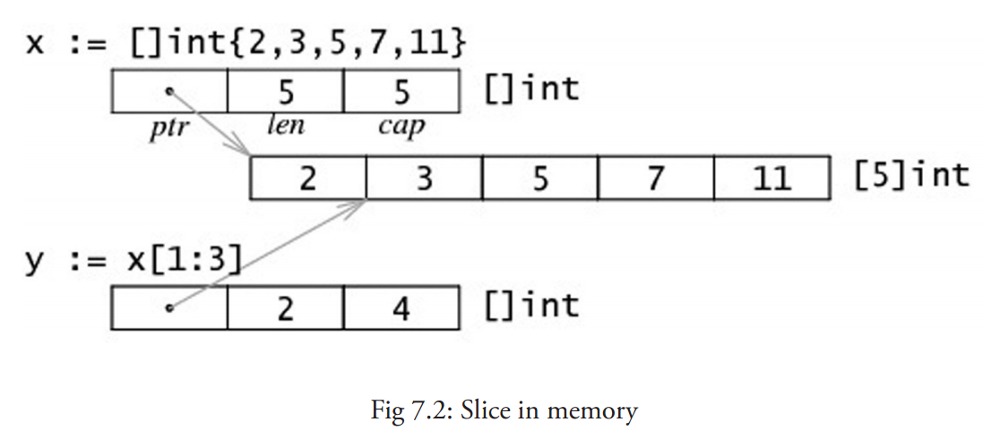
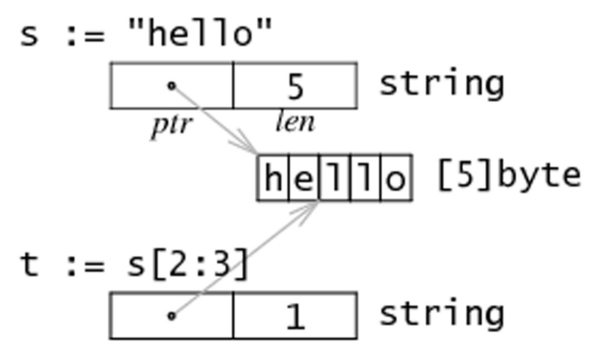
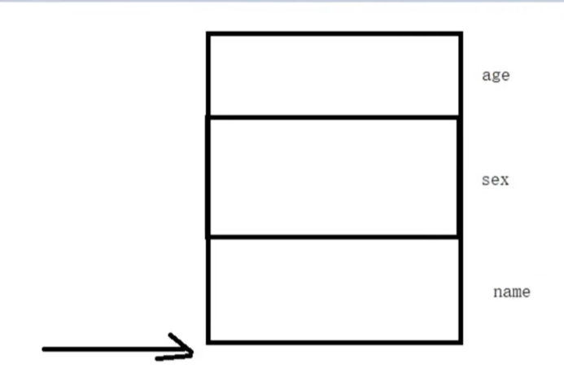
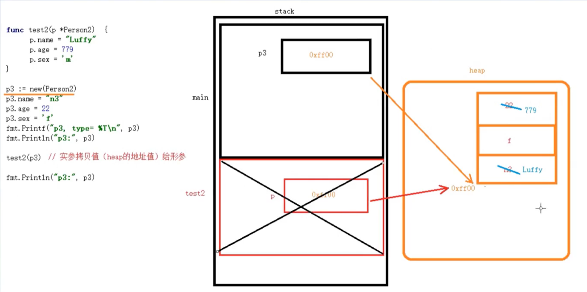

## array 数组

声明方式

```go
var identifier [len]type  // var arr [5]int

var arrAge = [5]int{18, 20, 15, 22, 16}  // 声明容量为5的数组并初始化
var arrLazy = [...]int{5, 6, 7, 8, 22}  // 初始化数组自动计算容量（实际上已是切片）
var arrLazy = []int{5, 6, 7, 8, 22}	 //  初始化得到的实际上是切片slice
var arrKeyValue = [5]string{3: "Chris", 4: "Ron"} //  0,1,2 都未空值
var arrKeyValue = []string{3: "Chris", 4: "Ron"}	//  初始化得到的实际上是切片slice
```

---

## slice 切片

本质

不是一组数组的指针，是一种数据结构，用来操作内部元素。

```jsx
切片名称 [low : high : max]
low: 起始下标位置
high: 结束下标位置 len = high - low
max: 容量 cap = max - low
```

声明方式

```go
var slice []type = arr[start:end]  // 已存在arr数组时

var slice []type = make([]type, len)  // 未生成数组时用make声明
var slice1 := make([]type, len) // 同上，简写

var s2 := make([]int, 10) // cap(s2) == len(s2) == 10

// make 函数参数
func make([]T, len, cap)
```

基本元素



---

## 数组与切片定义区别

> 创建数组时 `[n]` 指定数组长度
创建切片时 `[]` 为`空`，或者`...`

---

## 字符串与切片

内存结构



修改字符串中的某个字符

例如，将字符串 "hello" 转换为 "cello"：

```go
s := "hello"
c := []byte(s)
c[0] = 'c'
s2 := string(c) // s2 == "cello"
```

---

## append函数常用操作

我们在第 7.5 节提到的 append 非常有用，它能够用于各种方面的操作：

1. 将切片 b 的元素追加到切片 a 之后：`a = append(a, b...)`
2. 复制切片 a 的元素到新的切片 b 上：

    `b = make([]T, len(a))
    copy(b, a)`

3. 删除位于索引 i 的元素：`a = append(a[:i], a[i+1:]...)`
4. 切除切片 a 中从索引 i 至 j 位置的元素：`a = append(a[:i], a[j:]...)`
5. 为切片 a 扩展 j 个元素长度：`a = append(a, make([]T, j)...)`
6. 在索引 i 的位置插入元素 x：`a = append(a[:i], append([]T{x}, a[i:]...)...)`
7. 在索引 i 的位置插入长度为 j 的新切片：`a = append(a[:i], append(make([]T, j), a[i:]...)...)`
8. 在索引 i 的位置插入切片 b 的所有元素：`a = append(a[:i], append(b, a[i:]...)...)`
9. 取出位于切片 a 最末尾的元素 x：`x, a = a[len(a)-1], a[:len(a)-1]`
10. 将元素 x 追加到切片 a：`a = append(a, x)`

因此，您可以使用切片和 append 操作来表示任意可变长度的序列。

从数学的角度来看，切片相当于向量，如果需要的话可以定义一个向量作为切片的别名来进行操作。

如果您需要更加完整的方案，可以学习一下 Eleanor McHugh 编写的几个包：[slices](http://github.com/feyeleanor/slices)、[chain](http://github.com/feyeleanor/chain) 和 [lists](http://github.com/feyeleanor/lists)。

---

## map 字典

特点

key-value 键值对存储

map是无序的

声明方式

```go
var m1 = map[int]string // 声明map 赋值会出错
m2 := map[int]string{} // 声明并初始化map 可赋值
m3 := make(map[int]string) // 等值于m2

len(m2) // 获取map数量 
~~cap(m2)~~ // 报错!!! map不能使用cap方法

```

赋值

key值相同赋值会被覆盖

判断是否key是否存在

m2[key] 会返回两个值，第一个是value，第二个是bool代表key是否存在

```go
if v, has := m2[1]; has {
	fmt.Println("value=", v, "has=", has)
}
```

删除

```go
delete(m2[1])
```

---

## struct 结构体

声明方式

```go
type Person struct {
	name string
	age int
	sex byte
}

var man Person = Person{"tedy", 'm', 18}
man2 := Person{name: "tedy", sex: 'f'}
```

传参方式

默认值传递，一般不用，内存占用大，效率低

结构体地址

结构体指针变量的值 == 结构体首个元素的地址



结构体指针内存模型



强制自定义构建方法

```go
type matrix struct {
    ...
}

func NewMatrix(params) *matrix {
    m := new(matrix) // 初始化 m
    return m
}

package main
import "matrix"
...
wrong := new(matrix.matrix)     // 编译失败（matrix 是私有的）
right := matrix.NewMatrix(...)  // 实例化 matrix 的唯一方式
```

---

## 字符串处理

```go
// 按指定字符拆分
ret := strings.Split(str, ",")
// 按空格拆分
ret := strings.Fields(str)
// 判断字符串结束标记
ret := strings.HasSuffix("test.txt", ".txt")
// 判断字符串起始标记
ret := strings.HasPrefix("test.txt", "test")
```

---

## 文件操作

打开文件

```go
// 创建文件
// 不存在则创建，存在则清空
file, err := os.Create("./file.txt")
if err != nil {
	fmt.Println("create file error: ", err)
}
defer file.Close()
fmt.Println(file)

// 读取文件(只读)
// 不存在读取失败
file, err := os.Open("./file.txt")
if err != nil {
	fmt.Println("Open file error: ", err)
}
defer file.Close()
fmt.Println(file)

// 读写文件(只读/只写/读写)
file, err := os.OpenFile("./file.txt", os.O_CREATE|os.O_RDWR, 0755)
if err != nil {
	fmt.Println("OpenFile error: ", err)
}
defer file.Close()
fmt.Println(file)
```

写文件

```go
// 写字符串 
// windows \r\n 
// linux \n
writeByte, err := file.WriteString("Hello world\r\n")
if err != nil {
	fmt.Println("WriteString error: ", err)
}
fmt.Println(writeByte)

// 获取光标
offset, _ := file.Seek(5, io.SeekStart)
fmt.Println(offset)

// 指定位置写入
writeByte, err := file.WriteAt([]byte("1hello world"), offset)
if err != nil {
	fmt.Println("WriteAt error: ", err)
}
fmt.Println(writeByte)
```

读文件

```go
// 创建带有缓冲区的reader
reader := bufio.NewReader(file)
for {
  // 读取文件直到某字符 (按行读取)
	readByte, err := reader.ReadBytes('\n')
	if err == io.EOF {
		fmt.Println("ReadFile finished")
		break
	} else if err != nil {
		fmt.Println("ReadByte error: ", err)
	}
	fmt.Println(string(readByte))
}
```

---

## 读取文件目录

打开文件目录对象跟打开文件对象操作类似，`FileMode` 参数为 `os.ModeDir`

通过`Readdir`获取到的是目录下的文件对象切片，切片内容为`FileInfo`接口，遍历操作即可

```go
type FileInfo interface {
	Name() string       // base name of the file
	Size() int64        // length in bytes for regular files; system-dependent for others
	Mode() FileMode     // file mode bits
	ModTime() time.Time // modification time
		IsDir() bool        // abbreviation for Mode().IsDir()
	Sys() interface{}   // underlying data source (can return nil)
}

// 读目录
dirinfo, err := os.OpenFile("D:\\www", os.O_RDONLY, os.ModeDir)
if err != nil {
	fmt.Println("OpenDifInfo error: ", err)
}
defer dirinfo.Close()

fileInfo, err := dirinfo.Readdir(0)
if err != nil {
	fmt.Println("Readdir error: ", err)
}

for _, info := range fileInfo {
	if info.IsDir() {
		fmt.Println("dir: ", info.Name())
	} else {
		fmt.Println("file: ", info.Name())
	}
}
```

---

## runtime包

Gosched()：

出让当前goroutine所占用的CPU时间片。当再次获得CPU时，从出让位置恢复继续执行

— 时间片轮转调度算法

Goexit()：

return：返回当前函数调用者处。return之前的defer生效

Goexit：结束当前该goroutine调用者处。goexit之前的defer生效

GOMAXPROCS()：

设置当前进程使用最大CPU核数，函数返回上一次调用成功的设置值，首次调用返回默认值。

---

## channel 通道

定义

chdannel是一种数据类型，先进先出（FIFO）

```go
// 无缓冲通道
ch := make(chan int)
ch := make(chan string, 0)

// 读取
<- ch

// 写入
ch <-

// 读取和写入必须同时满足才能执行，否则一直阻塞等待

// 获取channel中剩余数据个数
len(ch)

// 获取channel容量
cap(ch)
```

---

## 位运算

与运算 & 

A与B位中`都`为`true`则结果为`true`

```go
1 & 1 -> 1
1 & 0 -> 0
0 & 1 -> 0
0 & 0 -> 0
```

或运算 | 

A与B位中`任意位`为`true`则结果为`true`

```go
1 | 1 -> 1
1 | 0 -> 1
0 | 1 -> 1
0 | 0 -> 0
```

异或运算 ^

A与B位`相同`则为`false`，`不同`则为`true`

```go
1 ^ 1 -> 0
1 ^ 0 -> 1
0 ^ 1 -> 1
0 ^ 0 -> 0
```

位清除 &^

B位为`true`，则`清零`A位；B位为`false`，则A位保持`不变`；

```go
1 &^ 1 -> 0
1 &^ 0 -> 1
0 &^ 1 -> 0
0 &^ 0 -> 0
```