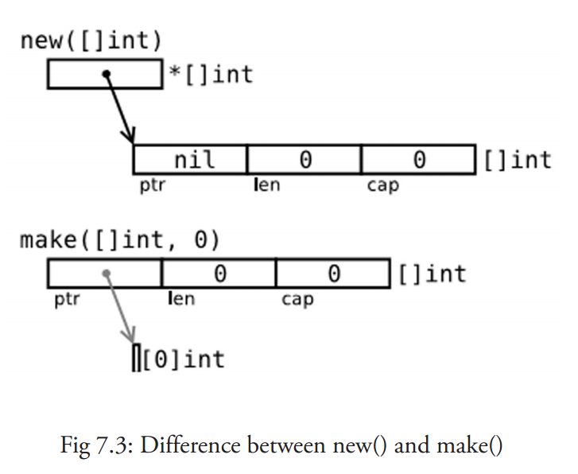

# Advanced

## new() 和 make() 的区别

看起来二者没有什么区别，都在堆上分配内存，但是它们的行为不同，适用于不同的类型。

- new(T) 为每个新的类型T分配一片内存，初始化为 0 并且返回类型为*T的内存地址：这种方法 **`返回一个指向类型为 T，值为 0 的地址的指针`**，它适用于值类型如数组和结构体；它相当于 `&T{}`。
- make(T) **`返回一个类型为 T 的初始值`**，它只适用于3种内建的引用类型：切片、map 和 channel。

换言之，new 函数分配内存，make 函数初始化；下图给出了区别：



*译者注：如何理解new、make、slice、map、channel的关系*

*1.slice、map以及channel都是golang内建的一种引用类型，三者在内存中存在多个组成部分， 需要对内存组成部分初始化后才能使用，而make就是对三者进行初始化的一种操作方式*

*2. new 获取的是存储指定变量内存地址的一个变量，对于变量内部结构并不会执行相应的初始化操作， 所以slice、map、channel需要make进行初始化并获取对应的内存地址，而非new简单的获取内存地址*

---

## fmt函数参数说明

基本

```
%v	the value in a default format
	when printing structs, the plus flag (%+v) adds field names
%#v	a Go-syntax representation of the value
%T	a Go-syntax representation of the type of the value
%%	a literal percent sign; consumes no value
```

The default format for %v is:

```
bool:                    %t
int, int8 etc.:          %d
uint, uint8 etc.:        %d, %#x if printed with %#v
float32, complex64, etc: %g
string:                  %s
chan:                    %p
pointer:                 %p
```

Boolean:

```
%t	the word true or false
```

Integer:

```
%b	base 2
%c	the character represented by the corresponding Unicode code point
%d	base 10
%o	base 8
%q	a single-quoted character literal safely escaped with Go syntax.
%x	base 16, with lower-case letters for a-f
%X	base 16, with upper-case letters for A-F
%U	Unicode format: U+1234; same as "U+%04X"
```

Floating-point and complex constituents:

```
%b	decimalless scientific notation with exponent a power of two,
	in the manner of strconv.FormatFloat with the 'b' format,
	e.g. -123456p-78
%e	scientific notation, e.g. -1.234456e+78
%E	scientific notation, e.g. -1.234456E+78
%f	decimal point but no exponent, e.g. 123.456
%F	synonym for %f
%g	%e for large exponents, %f otherwise
%G	%E for large exponents, %F otherwise
```

String and slice of bytes (treated equivalently with these verbs):

```
%s	the uninterpreted bytes of the string or slice
%q	a double-quoted string safely escaped with Go syntax
%x	base 16, lower-case, two characters per byte
%X	base 16, upper-case, two characters per byte
```

Pointer:

```
%p	base 16 notation, with leading 0x
```

---

---

## 调度模型

> 一言蔽之，调度的本质就是 P 将 G 合理的分配给某个 M 的过程。
> 

---

## 内存模型 *[referrence](https://zhuanlan.zhihu.com/p/76802887)*


- **Page**
  
    与TCMalloc中的Page相同，x64架构下1个Page的大小是8KB。上图的最下方，1个浅蓝色的长方形代表1个Page。
    
- **Span**
  
    一组连续的Page成为Span，Span是内存管理基本单位，代码中用mspan表示
    
- **mcache**
  
    mcache保存的是各种大小的Span，并按Span class分类，小对象直接从mcache分配内存，它起到了缓存的作用，并且可以无锁访问。
    
- **mcentral**
  
    所有线程共享的内存块，需要加锁访问。mcentral的Span不够用时会向mheap申请内存
    
- **mheap**
  
    堆内存的抽象，把从OS申请出的内存页组织成Span，并保存起来。mheap的Span不够用时会向OS申请内存。
    

---

## 并发模型

---

## 并发与并行区别

并发：指同一时刻有多条执行任务，CPU核心通过快速的切换时间单元实现的执行多任务。宏观上是同时的，但微观上仍是顺序执行的，只是进程间快速切换

并行：值同一时刻，多条指令再多个CPU内核中同时执行，宏观和微观上都是同时执行的。

---