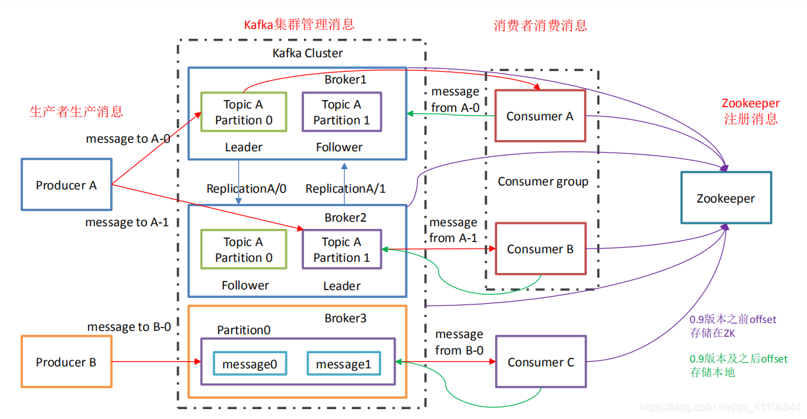

# 概述

## 基本名词

**Producer (消息生产者)：**

向 kafka broker 发消息的客户端；

**Consumer (消息消费者)：**

向 kafka broker 取消息的客户端；

**Consumer Group (消费者组)：**

由多个 consumer 组成。消费者组内每个消费者负责消费不同分区的数据，一个分区只能由一个组内消费者消费；消费者组之间互不影响。所有的消费者都属于某个消费者组，即消费者组是逻辑上的一个订阅者。

**Broker  (服务器)：**

一台 kafka 服务器就是一个 broker。一个集群由多个 broker 组成。一个broker可以容纳多个 topic。

**Replica (副本)：**

为保证集群中的某个节点发生故障时，该节点上的 partition 数据不丢失，且 kafka 仍然能够继续工作，kafka 提供了副本机制，一个 topic 的每个分区都有若干个副本，一个 leader 和若干个 follower。

**Leader (主)：**

每个分区多个副本的“主”，生产者发送数据的对象，以及消费者消费数据的对
象都是 leader。

**Follower (从)：**

每个分区多个副本中的“从”，实时从 leader 中同步数据，保持和 leader 数据的同步。leader 发生故障时，某个 follower 会成为新的 leader 。

**Topic (主题)：**

主题是承载消息的逻辑容器，在实际使用中多用来区分具体的业务。

**Partition (分区)：**

为了实现扩展性，一个非常大的 topic 可以分布到多个 broker（即服务器）上，一个 topic 可以分为多个 partition，每个 partition 是一个有序的队列；

**Rebalance (重平衡)：**

消费者组内某个消费者实例挂掉后，其他消费者实例自动重新分配订阅主题分区的过程。Rebalance 是 Kafka 消费者端实现高可用的重要手段。

## 核心原理

### 分区

分区的作用就是提供负载均衡的能力，或者说对数据进行分区的主要原因，就是为了实现系统的高伸缩性（Scalability）

**分区策略：**

1、轮询策略：轮询策略有非常优秀的负载均衡表现，它总是能保证消息最大限度地被平均分配到所有分区上，故默认情况下它是最合理的分区策略，也是我们最常用的分区策略之一。

2、随机策略：所谓随机就是我们随意地将消息放置到任意一个分区上。

3、按key指定策略：将计算得出相同的key值，分配到相同的分区上。**这种策略常用于某些需要顺序消费的业务应用场景。**

### 零拷贝

**传统的io操作**：

1、第一次：将磁盘文件，读取到操作系统内核缓冲区；

2、第二次：将内核缓冲区的数据，copy到application应用程序的buffer；

3、第三步：将application应用程序buffer中的数据，copy到socket网络发送缓冲区(属于操作系统内核的缓冲区)；

4、第四次：将socket buffer的数据，copy到网卡，由网卡进行网络传输。

总结：假设内容中途不需要任何修改，内核态与用户态第二和第三步的操作则是没有意义的，为了减少io的消耗，人们提出了零拷贝的思想。

**零拷贝方式**：

原理上都是为了减少io操作的次数

**1、mmap（Memory Mapped Files）**

<aside>
💡 将磁盘文件映射到内存, 用户通过修改内存就能修改磁盘文件。

</aside>

此方式适用于**Producer**到**Broker**的入列过程，这样即使**Broker**需要对消息进行修改，也可以减少io操作，直接讲内容修改映射到磁盘对应的空间，避免了用户态的过程io拷贝。

PS：mmap也有一个很明显的缺陷——不可靠，写到mmap中的数据并没有被真正的写到硬盘，操作系统会在程序主动调用flush的时候才把数据真正的写到硬盘。Kafka提供了一个参数——producer.type来控制是不是主动flush；如果Kafka写入到mmap之后就立即flush然后再返回Producer叫同步(sync)；写入mmap之后立即返回Producer不调用flush叫异步(async)。

**2、sendfile**

<aside>
💡 直接将内核态的硬件对接，不经过用户态的io交互

</aside>

此方式适用于**Broker**到**Consumer**的出列过程，消费端获取消息的时候，不需要经过用户态的修改，可以内核态硬件之间直接进行io交互。

